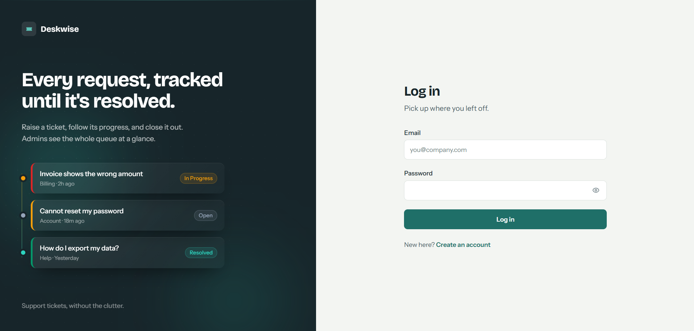
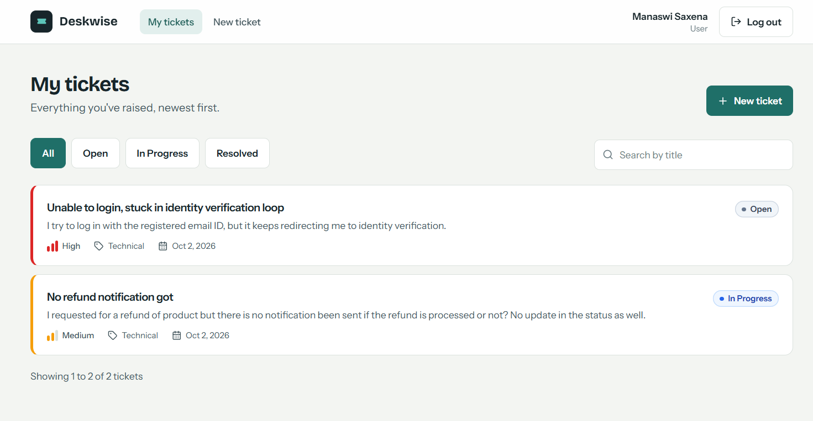
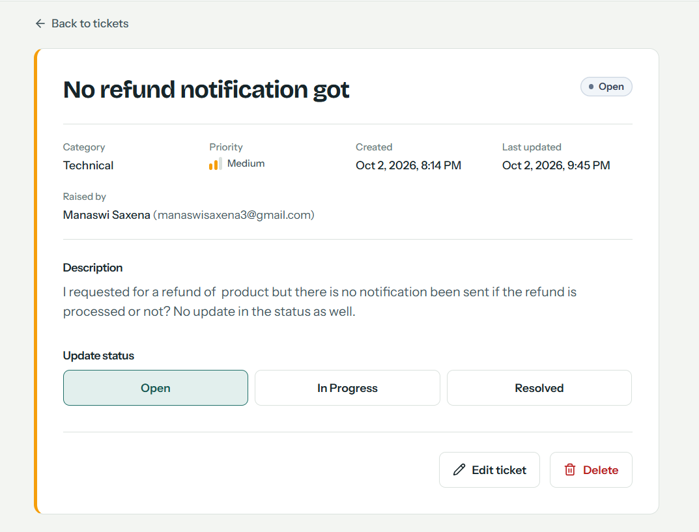
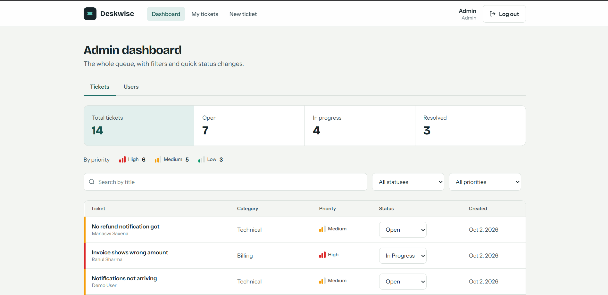

# Deskwise: Mini Helpdesk & Support Ticket System

A full-stack MERN application where users raise and track support tickets and admins manage the whole queue.

## Overview

- **Users** register, log in, raise tickets (title, description, category, priority), and view, edit, filter, search and delete their own tickets.
- **Admins** see every ticket in the system with live counts (total / open / in progress / resolved / by priority), filter and search the queue, change ticket status, and browse all users with their ticket counts.
- **Auth** uses server-side sessions (Passport local strategy) with an HTTP-only cookie. Roles are `user` and `admin`.

## Tech Stack

| Layer | Technologies |
| --- | --- |
| Frontend | React 18, Vite, React Router 6, Tailwind CSS, React Hook Form + Zod, Axios, react-hot-toast, lucide-react |
| Backend | Node.js (>= 18.17), Express 4, Passport (local), express-session + connect-mongo, Zod, bcryptjs |
| Database | MongoDB with Mongoose 8 |
| Security | helmet, CORS allow-list, express-mongo-sanitize, express-rate-limit (30 requests / 15 min on login and register), bcrypt (12 rounds) |

## Screenshots

| Login | My tickets |
| --- | --- |
|  |  |

| Ticket detail | Admin dashboard |
| --- | --- |
|  |  |

## Project Structure

```
DeskWise/
├── client/               React app (Vite)
│   └── src/
│       ├── api/          Axios instance and API helpers
│       ├── components/   Layout, forms, badges, route guards
│       ├── context/      AuthContext
│       ├── lib/          Zod schemas, hooks, constants
│       └── pages/        Login, Register, MyTickets, NewTicket, TicketDetail, AdminDashboard
└── server/               Express API
    └── src/
        ├── config/       env, db, passport
        ├── controllers/  auth, ticket, admin
        ├── middleware/   auth, validate, errorHandler
        ├── models/       User, Ticket
        ├── routes/       auth, tickets, admin
        ├── seed/         createAdmin, seedDemo
        └── validators/   Zod schemas and constants
```

## Security

- Passwords hashed with bcrypt (12 rounds), never returned in API responses
- HTTP-only session cookie holding only a session ID
- Ownership checks on every ticket route; admin routes protected by a server-side role check
- Server-side validation (Zod), NoSQL injection sanitising, rate limiting on auth routes
- Admin accounts cannot be created through public registration

## Design Decisions

- **Sessions with Passport instead of JWT:** the cookie is HTTP-only, so JavaScript can't read it, and logout invalidates the session on the server.
- **Offset pagination:** simple and enough for this scale.

## Setup Instructions

### Prerequisites
- Node.js 18.17 or newer
- MongoDB running locally, or a MongoDB Atlas connection string

### 1. Clone
```bash
git clone https://github.com/manaswi3/DeskWise.git
cd DeskWise
```

### 2. Backend
```bash
cd server
npm install
cp .env.example .env        # then edit the values (see below)
npm run dev                 # API on http://localhost:5000
```

### 3. Frontend
```bash
cd client
npm install
cp .env.example .env
npm run dev                 # App on http://localhost:5173
```

### 4. Create an admin and demo data (see Database Setup)
```bash
cd server
npm run seed:admin
npm run seed:demo
```

### Scripts

| Location | Command | Purpose |
| --- | --- | --- |
| server | `npm run dev` | Start API with auto-restart (`node --watch`) |
| server | `npm start` | Start API |
| server | `npm run seed:admin` | Create or promote the admin user |
| server | `npm run seed:demo` | Create the demo user and 12 sample tickets |
| client | `npm run dev` | Start Vite dev server |
| client | `npm run build` / `npm run preview` | Production build / preview |

## Environment Variables

### `server/.env`

| Variable | Required | Default | Description |
| --- | --- | --- | --- |
| `MONGODB_URI` | Yes | none | MongoDB connection string, e.g. `mongodb://127.0.0.1:27017/helpdesk` |
| `SESSION_SECRET` | Yes | none | Long random string used to sign session cookies |
| `PORT` | No | `5000` | API port |
| `NODE_ENV` | No | none | Set to `production` to enable secure cookies and trust proxy |
| `CLIENT_URL` | No | `http://localhost:5173` | Allowed frontend origin(s) for CORS; comma-separate multiple |
| `COOKIE_SAMESITE` | No | `lax` | Use `none` only when client and API are on different domains over HTTPS |
| `ADMIN_NAME` | No | `Admin` | Used by `seed:admin` |
| `ADMIN_EMAIL` | No | `admin@example.com` | Used by `seed:admin` |
| `ADMIN_PASSWORD` | No | `Admin1234` | Used by `seed:admin` (change it) |

The server exits on startup if `MONGODB_URI` or `SESSION_SECRET` is missing.

### `client/.env`

| Variable | Default | Description |
| --- | --- | --- |
| `VITE_API_URL` | `http://localhost:5000/api` | Base URL of the API |

## Database Setup

1. Start MongoDB locally (`mongod`), or create a free Atlas cluster and copy its connection string into `MONGODB_URI`.
2. No manual schema or migration step is needed. Mongoose creates these collections and indexes on first run:
   - `users` (unique index on `email`)
   - `tickets` (indexes on `user` and on `status + priority + createdAt`)
   - `sessions` (created by connect-mongo; sessions expire after 7 days)
3. Seed data:
   - `npm run seed:admin` creates the admin from `ADMIN_*` variables. If that email already exists, the user is promoted to admin.
   - `npm run seed:demo` creates `demo@example.com` and replaces that user's tickets with 12 sample ones.

### Demo credentials (after seeding)

| Role | Email | Password |
| --- | --- | --- |
| Admin | `admin@example.com` | `Admin1234` (or your `ADMIN_*` values) |
| User | `demo@example.com` | `Demo1234` |

## API Documentation

Base URL: `http://localhost:5000/api`. Authentication uses a session cookie (`helpdesk.sid`), so send requests with credentials. Errors return `{ "message": "...", "errors": { "field": "..." } }`.

### Health
| Method | Endpoint | Access | Description |
| --- | --- | --- | --- |
| GET | `/health` | Public | Returns `{ "status": "ok" }` |

### Auth
| Method | Endpoint | Access | Body | Description |
| --- | --- | --- | --- | --- |
| POST | `/auth/register` | Public | `name, email, password` | Create account and log in (201) |
| POST | `/auth/login` | Public | `email, password` | Log in |
| POST | `/auth/logout` | Public | none | Destroy session |
| GET | `/auth/me` | Public | none | Current user, or `null` |

### Tickets (logged-in user)
| Method | Endpoint | Description |
| --- | --- | --- |
| POST | `/tickets` | Create a ticket: `title, description, category, priority` |
| GET | `/tickets` | List my tickets (query: `page, limit, status, priority, search`) |
| GET | `/tickets/:id` | Get one ticket (owner or admin) |
| PATCH | `/tickets/:id` | Update any of `title, description, category, priority, status` |
| DELETE | `/tickets/:id` | Delete a ticket (owner or admin) |

### Admin (role `admin`)
| Method | Endpoint | Description |
| --- | --- | --- |
| GET | `/admin/tickets` | All tickets with user info (query: `page, limit, status, priority, search`) |
| PATCH | `/admin/tickets/:id/status` | Set status: `{ "status": "Open" \| "In Progress" \| "Resolved" }` |
| GET | `/admin/stats` | Totals by status and priority |
| GET | `/admin/users` | All users with `ticketCount` (query: `page, limit, search`) |

### Validation rules
- **Name:** 2–50 characters
- **Email:** valid email
- **Password:** 8–72 characters, with at least one letter and one number
- **Title:** 3–120 characters
- **Description:** 10–2000 characters
- **Category:** `Technical`, `Billing`, `Account`, `General`, `Feature Request`
- **Priority:** `Low`, `Medium`, `High` (default `Medium`)
- **Status:** `Open`, `In Progress`, `Resolved` (default `Open`)
- **Pagination:** `page` ≥ 1 (default 1), `limit` 1–50 (default 10). List responses include `pagination: { page, limit, total, pages }`.

## Additional Notes

- Run the API and the client at the same time, in two terminals. The client expects the API at `VITE_API_URL`.
- After login, admins land on `/admin` and users on `/tickets`. Non-admins are redirected away from `/admin`.
- Users can only see their own tickets, and a ticket outside their ownership returns 404. Admins can view any ticket.
- For deployment on separate domains, set `NODE_ENV=production`, `COOKIE_SAMESITE=none`, serve both over HTTPS, and set `CLIENT_URL` to the deployed frontend origin.
- `.env` files are git-ignored. Only the `.env.example` files are committed.